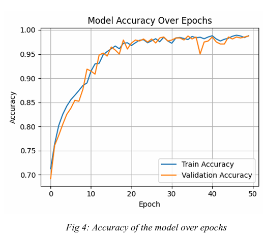
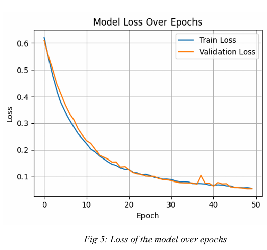
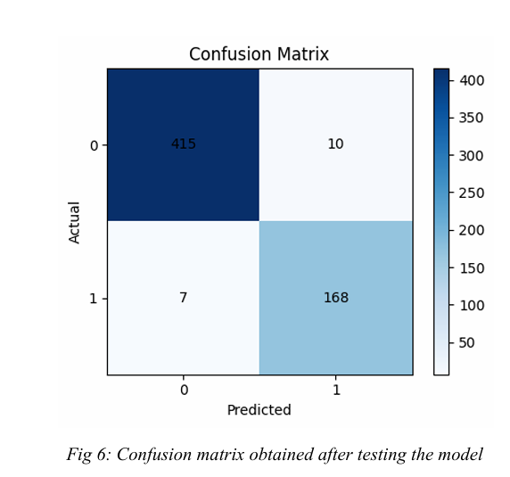
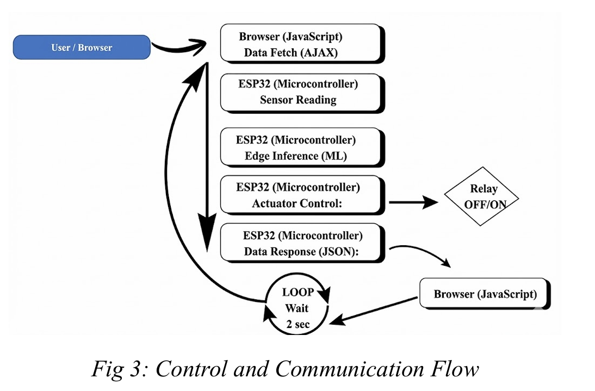
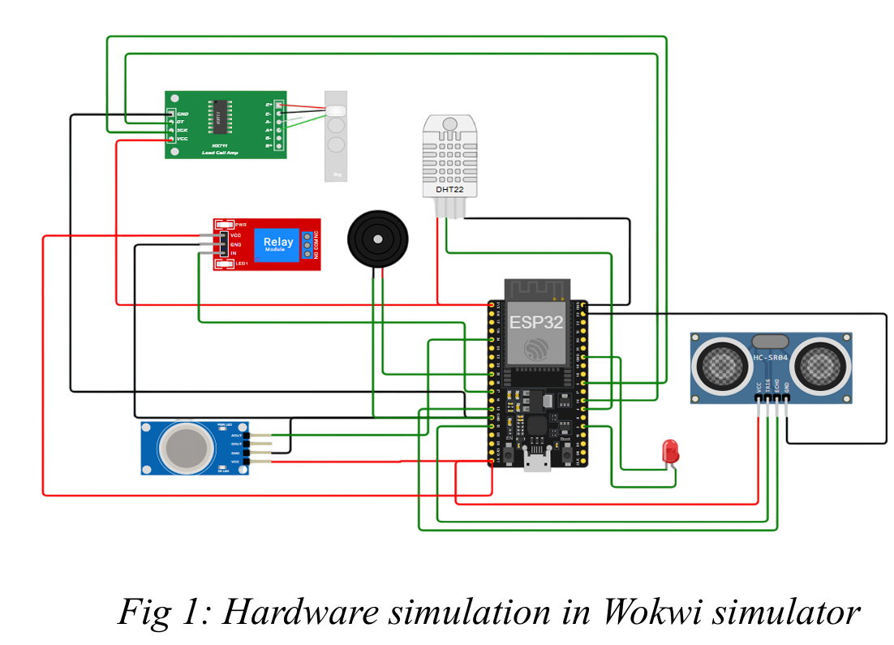

# 🍳 Smart Kitchen AIoT Safety System

AIoT-enabled kitchen hazard detection & prevention platform using **ESP32**,  
**Multi-Sensor Fusion**, and **TensorFlow Lite Micro**.

---

## 🚀 Project Overview

The **Smart Kitchen AIoT Safety System** is a low-cost **Edge AI + IoT solution**  
designed to detect hazardous cooking conditions in real time and prevent accidents.

Unlike traditional safety systems that react after smoke/fire detection,  
this system performs **proactive hazard prediction** using sensor fusion and  
a **lightweight neural network deployed directly on ESP32**.

---

## ✅ Key Features

- 📡 Multi-sensor fusion (Temperature, Gas, Distance, Weight)
- 🧠 Edge AI inference using TensorFlow Lite Micro
- ⚡ Real-time hazard classification (Safe / Hazardous)
- 🔌 Automatic relay-based safety shutdown
- 🚨 Audible & visual alerts (Buzzer / LED)
- 🌐 Live web dashboard monitoring
- ☁️ Cloud-independent architecture (low latency)

---

## 🧠 Technologies Used

### 🔧 Hardware Components
- ESP32 Development Board  
- DHT22 (Temperature & Humidity)  
- MQ2 Gas Sensor  
- HC-SR04 Ultrasonic Sensor  
- Load Cell + HX711  
- Relay Module  
- Buzzer / LED Indicators  

---

### 💻 Software Stack
- TensorFlow Lite Micro  
- Python / NumPy  
- Synthetic Dataset Generation  
- HTML / CSS / JavaScript  
- AJAX / JSON Communication  
- Wokwi IoT Simulator  

---

## 🏗 System Architecture

The system continuously collects sensor readings, performs **on-device ML inference**,  
and autonomously triggers safety mechanisms when hazardous conditions are detected.

---

## 📊 Machine Learning Model

🎯 **Model Accuracy: 97.17%**

✔ Lightweight Neural Network  
✔ Optimized for ESP32 Deployment  
✔ Stable Training & Validation Convergence  
✔ Balanced Precision & Recall  

---

### 📈 Accuracy Curve

---

### 📉 Loss Curve

---

### ✅ Confusion Matrix

---

### 📋 Evaluation Metrics

---

## 🔁 Control & Communication Flow

The ESP32 hosts an HTTP web server enabling:

- Live sensor visualization  
- Real-time hazard prediction updates  
- Automated actuator control  
- JSON-based browser communication  

---

## 🌐 Web Dashboard

The web interface provides:

✅ Live sensor readings  
✅ Hazard status display  
✅ System feedback  
✅ Smooth AJAX updates  

---

## 📸 Hardware Simulation (Wokwi)

System design and pin validation were first verified using the **Wokwi Simulator**,  
ensuring safe hardware integration and debugging.

---

## 📄 Research Contribution

This project was developed as part of an **IoT Academic Course Project**  
and resulted in a **conference research paper publication**.

📎 **Paper available in:** `/paper`

---

## 🔮 Future Enhancements

- 📊 Real-world sensor dataset collection  
- ☁️ MQTT / Cloud connectivity  
- 🔥 Additional safety sensors (CO / Flame)  
- 🧠 Edge anomaly detection models  
- 📱 Mobile app integration  

---

## 👩‍💻 Authors

- **Gopika Rajendran**  
- Team Members  

---

## 📜 License

This project is licensed under the **MIT License**.
